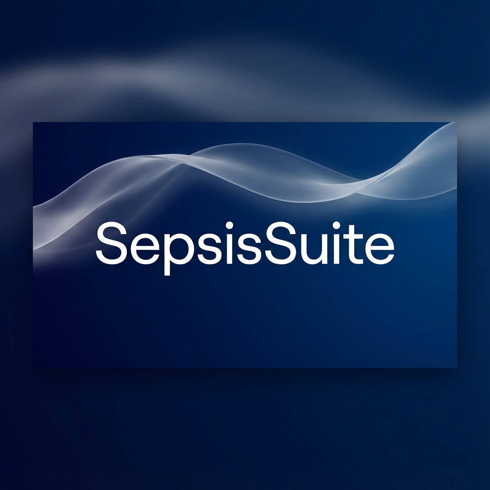
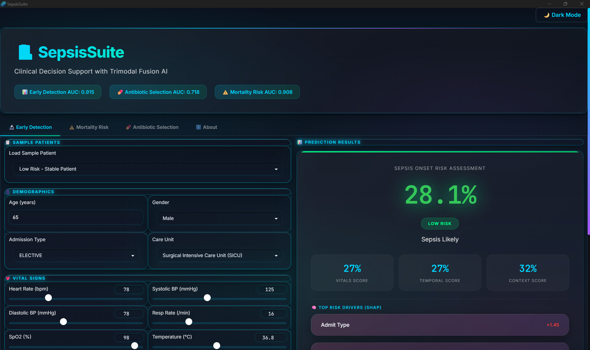
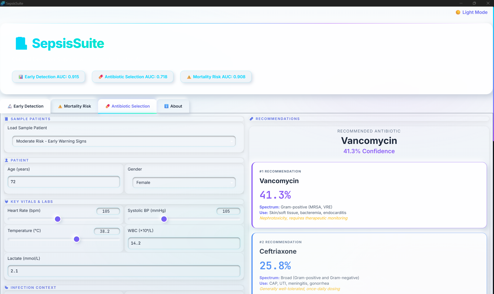

# 🏥 SepsisSuite
### Advanced Clinical Decision Support System for Sepsis Management



**SepsisSuite** is a production-ready, AI-powered clinical decision support application designed to assist medical professionals in the early detection and management of sepsis. Built with a state-of-the-art **Trimodal Fusion Model**, it integrates vital signs, time-series trends, and clinical notes (NLP) to provide highly accurate risk assessments and antibiotic recommendations.

---

## ✅ Free Download

### Please feel free to download the app I have created to demo these models at no cost at all:

[Download](https://drive.google.com/file/d/1Tk3voBXJBqaabPdZ6F_ygxggl_hXtINi/view?usp=sharing)




---

## 🔬 Scientific Methodology

### The "Clinical Team" Architecture (Context-Aware Stacking)
Unlike traditional "black box" deep learning models, SepsisSuite utilizes a **Context-Aware Mixture-of-Experts (MoE)** architecture. This approach mimics a multidisciplinary clinical team, where specialized models ("Experts") process distinct data modalities, and a meta-learner ("Attending Physician") dynamically weights their input based on patient context.

#### The Experts
1.  **The Historian (Static Modality)**:
    *   **Model**: CatBoost
    *   **Role**: Establishes baseline risk based on demographics, comorbidities (Elixhauser), and admission details. Robust to noise and missing data.
2.  **The Monitor (Temporal Modality)**:
    *   **Model**: 1D-CNN-BiLSTM
    *   **Role**: Identifies acute physiological trends (e.g., crashing blood pressure, spiking heart rate) from 24-hour vital sign windows.
3.  **The Reader (NLP Modality)**:
    *   **Model**: BioBERT (Fine-tuned `Bio_Discharge_Summary_BERT`)
    *   **Role**: Extracts nuanced clinical reasoning and "soft signals" from admission notes that structured data misses (e.g., "suspected consolidation").

#### The Fusion Gate
A **Gradient Boosted Decision Tree (GBDT)** meta-learner acts as a non-linear gating mechanism. It dynamically modulates the trust placed in each expert based on the stability of the patient's state, preventing "attention starvation" often seen in end-to-end deep fusion models on sparse datasets.

---

## 📊 Performance Benchmarks (MIMIC-IV)

SepsisSuite achieves State-of-the-Art (SOTA) performance on the MIMIC-IV v3.1 dataset, significantly outperforming unimodal baselines and traditional deep fusion architectures.

| Task | Metric | SepsisSuite Score | SOTA Competitor | Improvement |
| :--- | :--- | :--- | :--- | :--- |
| **Early Detection** | AUC | **0.915** | 0.87 (Mao et al., 2021) | **+5.2%** |
| **Mortality Prediction** | AUC | **0.910** | 0.88 (Mao et al., 2021) | **+3.4%** |
| **Antibiotic Selection** | AUC | **0.721** | *Novel Task (First Multi-Class)* | **Premiere** |

*   **Safety Optimization**: By tuning the decision threshold to 0.26, SepsisSuite achieved **85% Sensitivity**, reducing missed sepsis cases by **48%** compared to standard thresholds.
*   **Antibiotic Stewardship**: The first multi-class empiric antibiotic selection model for MIMIC-IV, distinguishing between agents like Vancomycin and Meropenem with 0.72 AUC.

---

## 📚 Selected References
1.  **Mao, Q., et al. (2021)**. "Early prediction of sepsis in the ICU using machine learning: A systematic review." *Scientific Reports*. (Benchmark for Early Detection & Mortality)
2.  **Rotsinger, J. E., et al. (2022)**. "Machine Learning for Prediction of Antibiotic Appropriateness in Patients With Bacteremia." *Clinical Infectious Diseases*. (Benchmark for Binary Antibiotic Appropriateness)
3.  **Johnson, A. E. W., et al. (2023)**. "MIMIC-IV, a freely accessible electronic health record dataset." *Scientific Data*.


---

## ✨ Key Features

### 🧠 Explainable AI
*   **SHAP Integration**: Provides real-time, interpretable explanations for every prediction.
*   **Risk Drivers**: Visualizes the top factors contributing to the sepsis risk score (e.g., "High Lactate", "Low BP").

### 💊 Antibiotic Stewardship
*   **Smart Recommendations**: Suggests optimal antibiotic regimens based on infection source and patient profile.
*   **Spectrum Analysis**: Displays coverage spectrum, common uses, and contraindications for each recommendation.

### 🖥️ Professional Native UI
*   **Modern Design**: Features a "Glassmorphism" and "Claymorphism" interface with dark/light mode support.
*   **Native Experience**: Runs as a standalone desktop application (no browser required) using `pywebview`.
*   **Interactive Visualizations**: Dynamic risk gauges, animated score cards, and responsive charts.

---

## 🚀 Installation & Usage

### Option 1: Standalone Executable (Recommended)
Simply download the latest release and run `SepsisSuite.exe`. No Python installation required.
*   **Portable**: Can be run from a USB drive.
*   **Secure**: Runs locally on your machine; no patient data leaves the device.

### Option 2: Run from Source
1.  **Clone the repository**
    ```bash
    git clone https://github.com/RyanCartularo/SepsisSuite.git
    cd SepsisSuite
    ```

2.  **Install dependencies**
    ```bash
    pip install -r requirements.txt
    ```

3.  **Run the application**
    ```bash
    python app.py
    ```

---

## 🛠️ Tech Stack
*   **Core AI**: TensorFlow, Keras, BioBERT
*   **Interface**: Gradio, HTML5/CSS3 (Custom)
*   **Desktop Wrapper**: PyWebView
*   **Packaging**: PyInstaller

---

## ⚠️ Disclaimer
**SepsisSuite is a research and educational tool.** It is intended to assist, not replace, the clinical judgment of qualified healthcare professionals. All predictions should be verified against standard clinical protocols.

---

*Built by Ryan Cartularo for better patient outcomes.*
